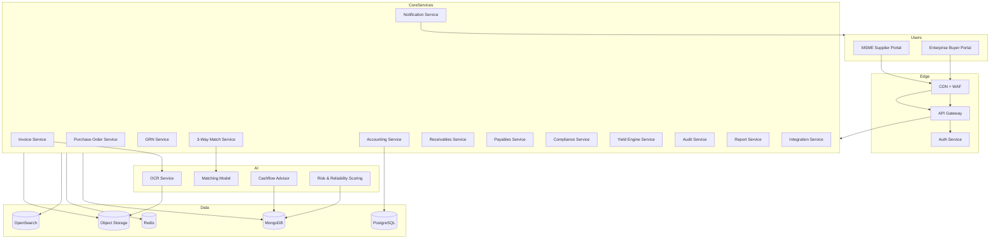
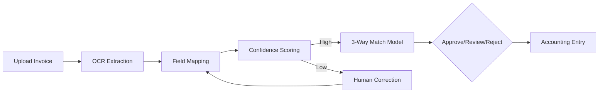

# FlowBridge Phase 1 Blueprint

This document defines a complete product blueprint, technical architecture, and development specification for Phase 1 of FlowBridge: an AI-powered B2B financial operating system for MSME suppliers and large enterprise buyers in India. Phase 1 excludes third-party financiers.

---

## 1. Product Vision and Scope

**Objective**
FlowBridge is the financial operating system for MSME–Enterprise supply chains. It unifies accounting, AP automation, receivables visibility, and compliance in one platform with AI-driven invoice ingestion and 3-way matching.

**Phase 1 Users**
- MSME suppliers
- Large enterprise buyers

**Out of Scope (Phase 1)**
- Third-party financiers
- External capital marketplace

---

## 2. Reference Platform Analysis

**Zoho Books strengths to inherit**
- Comprehensive double-entry accounting
- Strong invoicing, estimates, and payment reminders
- GST reporting and e-invoice readiness
- Clean UI for SMB workflows

**TallyPrime strengths to inherit**
- Robust ledger-centric accounting
- Fast data entry and offline-first workflow
- Strong GST compliance reporting

**FlowBridge improvements with AI**
- OCR-based invoice ingestion
- Automated 3-way matching for enterprise AP
- Real-time compliance monitoring for MSMED and 43B(h)
- Predictive cashflow and working capital intelligence

---

## 3. Core Financial Dashboard

**Required KPIs**
- Total receivables
- Total payables
- Cash inflow
- Cash outflow
- Net working capital
- Cashflow forecast (30/60/90 days)
- Payment cycle duration
- DSO (Days Sales Outstanding)
- DPO (Days Payable Outstanding)
- Vendor payment reliability
- Invoice processing efficiency

**Critical CFO Widgets**
- Invoice Processing Efficiency: percentage auto-matched by AI
- MSME Payment Compliance Monitor: invoices nearing 15-day or 45-day deadline
- Working Capital Impact: effect of early/late payments on WC
- Early Payment Yield Engine: treasury returns from early supplier payment
- Buyer Payment Reliability Analytics
- Supplier Risk Intelligence
- Cashflow Forecast & Payment Prediction

---

## 4. AI Document Ingestion Engine

**Input Types**
- PDF invoices
- Scanned documents
- Images

**Pipeline Workflow**
- Document upload
- OCR extraction
- Field mapping
- Confidence scoring
- Human correction interface

**Design Notes**
- OCR treated as infrastructure service
- All corrections captured as labeled training data

---

## 5. AI 3-Way Matching Engine

**Inputs**
- Purchase Order
- Goods Receipt Note (GRN)
- Supplier Invoice

**Fuzzy Matching Dimensions**
- Item code normalization
- Quantity tolerance
- Pricing tolerance
- Supplier identity matching
- Date proximity

**Output States**
- Approve
- Review Required
- Reject

**Goal**
Reduce manual AP verification from days to seconds.

---

## 6. Invoice Lifecycle

**Statuses**
- Draft
- Submitted
- Under Review
- Approved
- Rejected
- Paid

**Restriction**
Invoices cannot be edited after approval.

---

## 7. Accounting Core

**Double-entry Accounting**
- Chart of accounts
- General ledger
- Journal entries
- Trial balance
- Balance sheet
- Profit and loss
- Cash flow statement

---

## 8. Receivables Management

- Quotes and estimates
- Recurring invoices
- Payment reminders
- Receivable aging
- Customer payment history

---

## 9. Payables Management

- Vendor bills
- Purchase orders
- Approval workflows
- Vendor credits
- Payable aging

---

## 10. Vendor Management

Vendor profile fields:
- GST details
- PAN
- Bank accounts
- Transaction history
- Reliability score

---

## 11. Banking and Payments

**Integrations**
- UPI
- NEFT
- RTGS
- Corporate banking APIs

**Features**
- Automated payment reconciliation
- Payment status tracking

---

## 12. GST and Tax Compliance

- GST invoice generation
- GST reporting
- E-invoice compatibility
- E-way bill support

---

## 13. Inventory Management (Basic)

- SKU catalog
- Stock tracking
- Reorder alerts
- Purchase price tracking

---

## 14. Yield Engine

**Purpose**
Enable enterprise treasury to offer early payments for supplier discounts.

**Features**
- Liquidity tracking
- Supplier invoice eligibility
- Discount proposals
- Yield calculation

---

## 15. AI Cashflow Advisor

- Expected payment dates
- Predicted delays
- Working capital shortage alerts
- Early payment recommendations

---

## 16. MSME Payment Compliance Engine

**Rules**
- No written agreement: payment within 15 days
- Written agreement: payment within 45 days

---

## 17. Delayed Payment Penalty Calculator

**Formula**
- Compound interest
- Monthly rests
- Rate = 3 × RBI bank rate

**Outputs**
- Original invoice value
- Accumulated interest
- Total payable

---

## 18. Samadhaan Escalation Assistant

- Generates documentation for MSME Samadhaan escalation
- Tracks submission status

---

## 19. Section 43B(h) Compliance Radar

- Alerts enterprises about unpaid MSME invoices
- Highlights risk of tax deduction disallowance

---

## 20. Advanced Intelligence Features

- Buyer Payment Reliability Score
- Supplier Risk Score
- Intelligent Payment Prediction
- Supplier Network Graph
- Smart Invoice Fraud Detection
- Trust and Reputation System

---

## 21. Strategic Data Features

- Invoice Liquidity Score
- Supply Chain Graph Intelligence
- Working Capital Optimization AI
- MSME Working Capital Passport

---

## 22. Supplier Onboarding Engine

**Workflow**
- Enterprise sends invite link
- Supplier profile auto-created
- GST data prefilled
- Supplier begins uploading invoices

---

## 23. Dispute Resolution Workspace

- Threaded chat
- Document attachments
- Resolution tracking

---

## 24. ERP and Accounting Integrations

Supported systems:
- SAP
- Oracle
- Tally
- Zoho Books

Synced data:
- Invoices
- Vendors
- Purchase orders
- Accounting entries

---

## 25. UI Navigation Structure

Left navigation menu:
- Dashboard
- Invoices
- Receivables
- Payables
- Vendors
- Buyers
- Yield Engine
- Reports
- Audit Hub
- Settings

---

## 26. User Management

**RBAC**
- Admin can add team members
- Assign permissions
- Remove users

**Company Settings**
- Bank accounts
- GSTN
- PAN
- Udyam registration

---

## 27. Notification System

Notification center events:
- Invoice approvals
- Payment reminders
- Compliance alerts
- Discount offers

---

# 28. Technical Architecture

## 28.1 System Architecture Diagram

---

## 28.2 Microservices Architecture

Core services:
- Auth service
- User and company service
- Invoice service
- Purchase order service
- GRN service
- Matching service
- Accounting service
- Receivables service
- Payables service
- Vendor service
- Compliance service
- Yield engine service
- Notification service
- Audit service
- Report service
- Integration service
- AI service

---

## 28.3 Data Architecture and Storage

**Primary Datastores**
- MongoDB for operational data
- PostgreSQL for ledger and journal integrity
- Redis for cache and queues
- OpenSearch for full-text search
- Object storage for documents

**Phase 1 Free Resource Options**
- MongoDB Community or Atlas free tier
- PostgreSQL local or free tier
- Redis local
- MinIO for object storage
- Meilisearch or OpenSearch local

All storage access goes through provider adapters so migration to AWS is a config change.

---

## 28.4 Database Schema

### Core Collections (MongoDB)

**tenants**
- _id
- name
- type: msme | enterprise
- gstin
- pan
- udyam_number
- address
- settings

**users**
- _id
- tenant_id
- email
- password_hash
- role
- permissions
- mfa_enabled
- last_login
- created_at

**companies**
- _id
- tenant_id
- company_name
- gstin
- pan
- udyam_number
- bank_accounts
- erp_config
- subscription_tier

**vendors**
- _id
- tenant_id
- gstin
- pan
- bank_accounts
- reliability_score
- dispute_count

**invoices**
- _id
- tenant_id
- invoice_number
- seller_id
- buyer_id
- issue_date
- delivery_date
- due_date
- status
- totals
- tax_details
- line_items
- match_result
- compliance_deadline
- penalty_accrued
- audit_trail

**purchase_orders**
- _id
- tenant_id
- po_number
- supplier_id
- status
- totals
- line_items

**grn_receipts**
- _id
- tenant_id
- grn_number
- po_id
- received_items

**disputes**
- _id
- invoice_id
- status
- thread
- attachments

**notifications**
- _id
- user_id
- type
- payload
- read_at

### Accounting (PostgreSQL)

**chart_of_accounts**
- id
- tenant_id
- code
- name
- type

**journal_entries**
- id
- tenant_id
- entry_date
- reference
- memo

**journal_lines**
- id
- journal_entry_id
- account_id
- debit
- credit

---

## 28.5 API Specification (REST)

Auth:
- POST /api/auth/register
- POST /api/auth/login
- POST /api/auth/logout

Invoices:
- GET /api/invoices
- POST /api/invoices
- GET /api/invoices/{id}
- PATCH /api/invoices/{id}
- POST /api/invoices/{id}/submit
- POST /api/invoices/{id}/approve
- POST /api/invoices/{id}/reject
- POST /api/invoices/{id}/pay

Matching:
- POST /api/matching/run
- GET /api/matching/{invoiceId}

Compliance:
- GET /api/compliance/43bh-radar
- GET /api/compliance/penalty/{invoiceId}
- POST /api/compliance/samadhaan-draft

Accounting:
- GET /api/accounting/ledger
- POST /api/accounting/journal-entry
- GET /api/accounting/financials

Vendors:
- GET /api/vendors
- POST /api/vendors

Payments:
- POST /api/payments/execute
- POST /api/payments/reconcile

---

## 28.6 AI Pipeline Architecture

---

## 28.7 Scoring Models

**Buyer Payment Reliability Score**
- Features: DPO trend, overdue ratio, dispute frequency, avg approval time
- Output: 0-100

**Supplier Risk Score**
- Features: invoice error rate, mismatch frequency, dispute history
- Output: 0-100

**Invoice Liquidity Score**
- Features: approval confidence, buyer reliability, payment history
- Output: 0-100

---

## 28.8 UI Pages and Layouts

**MSME Portal**
- Dashboard
- Invoices
- Receivables
- Buyers
- Compliance
- Reports
- Settings

**Enterprise Portal**
- Dashboard
- Payables
- Invoices
- Vendors
- Yield Engine
- Audit Hub
- Reports
- Settings

**Admin Console**
- User management
- Company settings
- Integrations
- Logs

Wireframes are designed around a KPI header, widgets grid, and detailed tables.

---

## 28.9 Integration Architecture

- ERP connectors via integration service
- Data sync with SAP, Oracle, Tally, Zoho
- Bank APIs for payment execution and reconciliation

---

## 28.10 Security Architecture

- JWT + refresh tokens
- RBAC per tenant
- Data encryption at rest and in transit
- Audit trails for all state changes
- Secure vault for API keys

---

## 28.11 Cloud Deployment Architecture

Phase 1 Capstone resources:
- Single-node deployment with Docker Compose
- Local Postgres, MongoDB, Redis
- MinIO for object storage
- OpenSearch or Meilisearch

Migration readiness:
- Storage adapters for AWS S3 and RDS
- Kubernetes-ready service boundaries
- Infrastructure as code templates prepared for AWS later

---

# 29. Immediate Development Plan

Phase 1 build priorities:
- Core invoice and 3-way match workflow
- Compliance engine with MSMED rules and penalty calculator
- Basic accounting ledger
- Portals with dashboard KPIs
- OCR pipeline and correction UI
- Integration stubs with adapters

---

End of Phase 1 Blueprint
